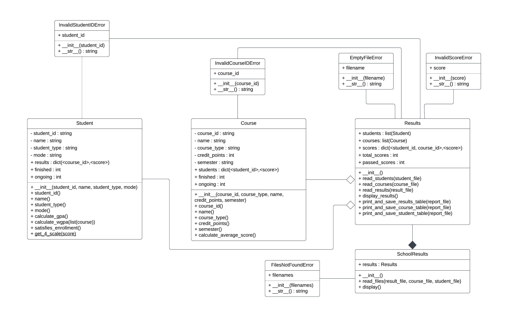

# my_school

Functionalities Requirements:

------------------------------------------- LEVEL 1 -------------------------------------------

Your project is to implement the required functionalities in the Object-Oriented (OO) style with at
least three classes: Results, Course, and Student. You need to design appropriate static/instance
variables, constructors, and static/instance methods in these classes. The class related info should be
encapsulated inside the corresponding class.
At this level, your program can read data from three files specified in the command line. The files store
the course information (course file), student information (student file), and the results of students in
these courses (result file). Your program should create a list of Course objects, a list of Student objects,
and a variable (you can think carefully about which data type to use) to store the students' scores. You
should design the classes properly so that these actions can be encapsulated within the appropriate
classes. Note that, at this level, we only know the IDs of the students and the courses. These IDs are
all unique.
In the main class, your program should create a Results object, call its read_courses(course_file_name)
method to load data from the course file, read_students(student_file_name) method to load data from
the student file, and read_results(result_file_name) method to load data from the result file, and finally
call the display_results() method to display the results of the students in the required format (as
specified in the following).
Below are examples of the three files: course file, student file, and result file.
In this level, the course file only consists of the course IDs with each course ID being in one line.
Similarly, in this level, the student file also only consists of the student IDs with each student ID being
in one line.
Finally, for the result file, the data fields in this file are separated by commas and new lines. Each row
contains the student ID, the course ID, and the corresponding result of the student for that course. The
format of each row is always student_ID, course_ID, score. For example, in our result file example,
the student S001 enrolled in the course ISYS089 and got a score of 41.8. Or the student S012 also
enrolled in the course ISYS089 and got a score of 76.5. Besides, there will be rows where the scores
are empty, meaning the student enrolled in the course but haven’t got the result of that course yet (on-
going). You can assume there are no duplicate or redundant rows. In this level, you can assume the
format of the data in the file is always correct.
Your program should print a message indicating how to run the program if an incorrect number of data
files is passed in as command line arguments. Otherwise, it can display a table showing the scores of
all students for all the courses, and two sentences showing the total number of students and courses,
and the pass rate (in percent). The score of a student for each course is displayed as a number with 1
digit after the decimal point. In the table, if a student does not enroll in a particular course, then the
data field at that location is empty. On the other hand, if a student already enrolled in a course but the
result is not available yet, then the data field at that location is shown as a double dash (--). Also, the
data in the columns in the table are aligned, in particular, the student IDs are aligned to the left whilst
the scores of all the courses are aligned to the right. Finally, the pass rate is computed as the percentage
of passed scores (equal to or larger than 49.5 marks) over the total of available scores. For example, in
the example result file above, the total of available scores is 16, and the total of pass scores is 13,
therefore, the pass rate is 13/16*100% = 81.25%.
The printed messages corresponding to two scenarios need to be exactly as below:
1. This is an example when a wrong number of arguments is passed in as command line arguments.
Note there could be different scenarios for a wrong number of command line arguments, your
program needs to handle all.
2. This is when a result file, course file, and student file are passed in as command line arguments.
Note that users can specify different file names, not necessarily the names results.txt, courses.txt,
students.txt. The first file is always the result file, the second file is the course file, and the last
file is the student file.

------------------------------------------- LEVEL 2 -------------------------------------------

At this level, your program can support more information about courses. Now, apart from the ID, each
course will have a name, credit point, and offered semester(s). All IDs, names, credits, and offered
semesters can be modified. There are two types of courses: Core Course and Elective Course. Core
courses can have different credit points whilst all elective courses have the same credit point, which is
6 by default. All core courses are offered in all semesters whilst the elective courses can have different
offered semesters. You should define appropriate variables, getters, and setters for courses.
Also, a course should have a method to compute some statistics, e.g., the number of students finished
the course, the number of students that are doing the course (on-going), the average score, etc. (it is
your choice to define the necessary statistics to compute). You can define extra methods if necessary.
At this level, the course file will have more information. The course file includes the course IDs, the
course types, the course names, the credit points, and the offered semester (for elective courses). You
can assume there are no duplicate or redundant courses. You can assume all the courses available in
this file are also available in the result file (in the PASS level), and vice versa.
At this level, your program can now print course information tables on screen (in addition to the result
information table) and save these tables into a file name reports.txt. For example, given the above
result file (in the PASS level) and the course file (in this level), the course information tables should
look like below. Note the content within the reports.txt file should also look the same. Also, users can
specify different file names, not necessary the names results.txt, courses.txt, students.txt. The first file
is always the result file, the second file is the course file, and the last file is the student file.
The Course information message displays two tables: one table for the core courses and one table for
the elective courses. In each table, the CourseID column shows the courses’ IDs, the Name column
shows the course names, the Type column shows the types of the courses (C for core courses, and E
for elective courses), the Semester column shows the semesters the courses offered (All for all
semesters, Sem1 for Semester 1, Sem2 for Semester 2). The Average column displays the average
score of all students who finished the course – note the average scores are shown with 2 digits after
the decimal point. The Nfinish column displays the number of students who already finished the
courses (already received marks), and the Nongoing column displays the number students who are still
taking the courses (results not yet available).
Note apart from these two tables, your program should also display two messages indicating the most
difficult core course and elective course. The most difficult course is the course with the lowest average
mark. In each course type, if there are multiple courses with the lowest average marks, you can choose
either to display one course or display all courses.

------------------------------------------- LEVEL 3  -------------------------------------------

At this level, your program can support two types of students: Undergraduate Students and
Postgraduate Students. Undergraduate students always need to enroll as full-time students whilst
postgraduate students can enroll as either full-time or part-time students. The minimum number of
enrolled courses for a full-time student is 4 whist the minimum number of enrolled courses for a part-
time student is 2. A student should have a method to compute some useful statistics for the student,
e.g., the number of courses they finished, the average GPA, the number of ongoing courses, etc. (it is
your choice to define the necessary statistics to compute). It should also have a method to check if a
student satisfies the enrollment requirement (enrolling in equal to or more than the minimum number
of courses required – note these can be courses that students already finished or are currently taking).
You can define extra methods for the students if necessary.
At this level, the student file will have more information. The file includes the student IDs, the student
names, the student types, and the mode for postgraduate students (full-time or part-time). You can
assume there are no duplicate or redundant students. You can assume all students in the result file (in
the PASS level) appeared in this file and vice versa. An example of the student file is as follows.
At this level, your program can now print student information tables on screen (in addition to the result
information table and course information tables) and store these tables in the text file reports.txt (from
the CREDIT level). Given the above result file (in the PASS level), the course file (in the CREDIT
level), and the student file (in this level), the student information tables should look like below. Note
the content within the reports.txt file should also look the same. Also, in the command line, users can
specify different file names, not necessary the names results.txt, courses.txt, students.txt. The first file
is always the result file, the second file is the course file, and the last file is the student file.
There are two tables, one for Postgraduate students and one for Undergraduate students. The StudentID
column shows the student IDs, the Name column shows the student names, the Type column shows
the student types (PG for Postgraduate students and UG for Undergraduate students), and the Mode
column shows the enroll mode of the students (FT for full-time and PT for part-time). The Nfinish
column shows the number of courses the students already finished. The Nongoing column shows the
number of courses the students are currently taking. The GPA(100) column displays the average GPAs
of the students on a scale of 100. The GPA(4) column displays the average GPAs of the students on a
scale of 4: a result >= 79.5 receives 4 points, a result >= 69.5 and < 79.5 receives 3 points, a result >=
59.5 and < 69.5 receives 2 points, a result >= 49.5 and < 59.5 receives 1 point.
In the tables, the data in the StudentID and Name columns are aligned to the left whilst the data in all
other columns are aligned to the right. Besides, in the tables, if a student doesn’t satisfy the requirement
of minimum courses enrolled then an exclamation mark (!) will be added next to the student’s name.
For example, in the table above, the student Jack is a full-time student but currently only enrolled in 3
courses, therefore, there is a (!) appears next to the student’s name.
Apart from the student information tables, two sentences indicating the best Postgraduate student and
Undergraduate student, along with their GPA(4) scores, are also shown. The best students are the
students with the highest GPA (scale of 4). In each student type, if there are multiple students with the
highest scores, you can choose to display one or all these students.

------------------------------------------- LEVEL 4 -------------------------------------------

At this level, your program can handle some variations in the files using built-in/custom exceptions:
1. When any of the file cannot be found, then your program should print a message indicating the
names of the files that cannot be found and then quit gracefully. You can assume users always
type the file names in the right order in the command line, e.g., the result file first, the course
file second, and the student file third.
2. The program will exit and indicate the corresponding error when one of these errors occurs:
a. The result file is empty;
b. Any of the scores in the result file is not a valid number;
c. The student ID doesn’t start with the letter S;
d. The course ID doesn’t start with either COSC, ISYS or MATH.

The program will have some additional requirements (some might be challenging):
1. In this level, the student information tables now have one additional column, WGPA(4), which
is the weighted GPA(4) based on the course credits. The WGPA(4) of each student is computed
by multiplying the scores the student obtained for the courses they took with the credits of
those courses, and then dividing by the total credits. For example, the student S034 has a score
of 85.7 (equivalent to 4) for COSC123 (with 6 credit points), a score of 89.0 (equivalent to 4)
for ISYS089 (with 24 credit points), and a score of 74.5 (equivalent to 3) for ISYS273 (with
12 credit points). Therefore, the WGPA(4) of this student can be computed as (4x6 + 4x24 +
3x12) /(6+24+12) = 3.71. An example of the student information tables with the WGPA(4)
columns is shown in the below.
2. In this level, the course information tables are sorted (from high to low) based on the Average
column (for each course type). Note that this is also reflected in the reports.txt file.
3. In this level, the student information tables are sorted (from high to low) based on the WGPA(4)
column (for each student type). Note that this is also reflected in the reports.txt file.
4. The reports.txt is accumulated, which means when the program runs, it will not overwrite the
previous report, but instead, it places the new report on top of the file (i.e., the newest report is
always at the top of the reports.txt file). In addition, the date and time when the report was
generated (in the format dd/mm/yyyy hh:mm:ss, e.g. 01/06/2023 09:45:00) are also saved in
the text file for each report.

Class Diagram : 
